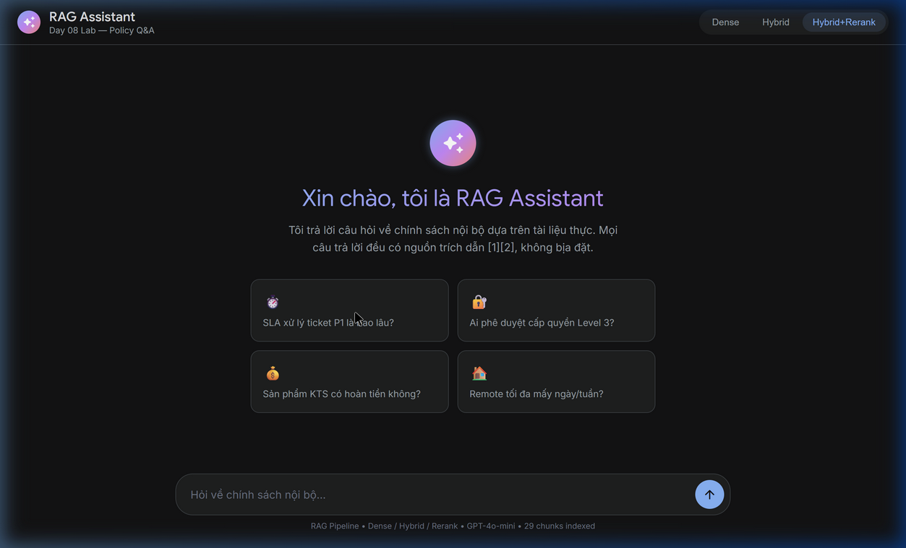
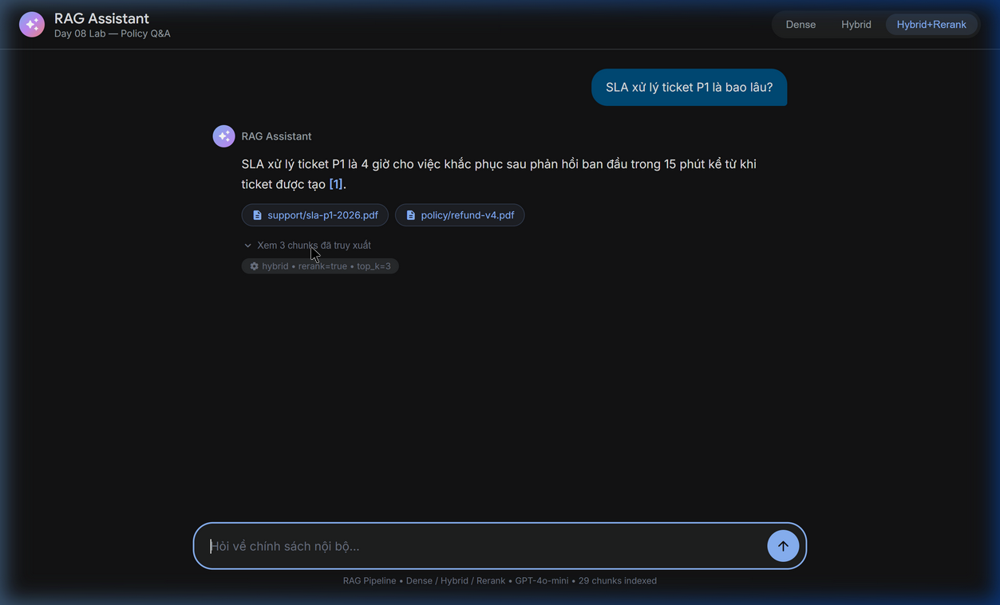
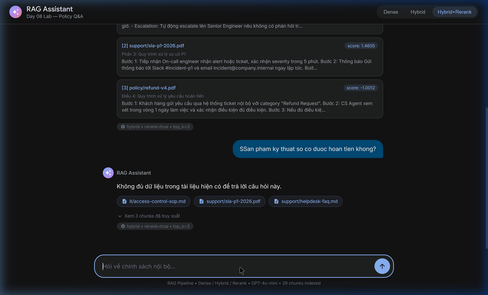

# Báo Cáo Cá Nhân — Lab Day 08: RAG Pipeline

**Họ và tên:** Trịnh Kế Tiến - 2A202600500
**Vai trò trong nhóm:** Tech Lead  
**Ngày nộp:** 2026-04-13  
**Độ dài yêu cầu:** 500–800 từ

---

## 1. Tôi đã làm gì trong lab này?

Với vai trò Tech Lead, tôi chịu trách nhiệm thiết kế kiến trúc tổng thể pipeline RAG và đưa ra các quyết định kỹ thuật cấp nhóm. Cụ thể, tôi implement toàn bộ Sprint 1 (indexing pipeline): viết hàm `preprocess_document()` để extract 5 metadata fields từ header tài liệu, thiết kế chiến lược heading-based chunking với overlap ~80 tokens, tích hợp Sentence Transformers embedding model (`paraphrase-multilingual-MiniLM-L12-v2`) chạy local, và lưu 29 chunks vào ChromaDB với cosine similarity. Tôi cũng quyết định kiến trúc Singleton pattern cho embedding model để tránh load lại mỗi lần gọi, và chọn cấu trúc prompt grounded 4 quy tắc (evidence-only, abstain, citation, short/clear) làm chuẩn cho cả nhóm. Công việc của tôi tạo nền tảng data layer cho Retrieval Owner xây Sprint 2-3 và Eval Owner chạy Sprint 4.

---

## 2. Điều tôi hiểu rõ hơn sau lab này

Trước lab, tôi biết RAG là "tìm tài liệu rồi đưa cho AI đọc", nhưng chưa hiểu tại sao chunking lại quan trọng đến vậy. Sau khi implement, tôi nhận ra chunking là bottleneck (nút thắt cổ chai) của cả pipeline: nếu cắt cứng theo số ký tự, chunk có thể chứa nửa đầu Điều 2 và nửa cuối Điều 1 — retriever tìm đúng chunk nhưng LLM vẫn trả lời thiếu vì context bị cắt. Heading-based chunking giải quyết vấn đề này bằng cách tôn trọng cấu trúc tự nhiên của tài liệu. Một insight khác: metadata không chỉ để "trang trí" mà thực sự giúp lọc kết quả — ví dụ trường `effective_date` có thể loại bỏ policy đã hết hiệu lực, tránh việc AI trích dẫn thông tin cũ.

---

## 3. Điều tôi ngạc nhiên hoặc gặp khó khăn

Điều ngạc nhiên nhất là lỗi `UnicodeEncodeError` trên Windows khi in ký tự ✓ và ✗ ra console. Tôi mất thời gian debug vì lỗi không nằm ở logic code mà ở encoding mặc định `cp1258` của Windows tiếng Việt. Giải pháp đơn giản: set `PYTHONIOENCODING=utf-8` trước khi chạy. Giả thuyết ban đầu của tôi là "Python 3 đã xử lý Unicode tốt rồi" — thực tế terminal Windows vẫn dùng code page legacy. Ngoài ra, tôi cũng ngạc nhiên khi thấy model embedding local (MiniLM-L12) cho kết quả retrieval khá tốt (Context Recall 5.0/5) dù chỉ có 384 dimensions — không nhất thiết phải dùng OpenAI embedding tốn tiền.

---

## 4. Phân tích một câu hỏi test (sẽ cập nhật bằng grading_questions sau 17:00)

> **Lưu ý:** Phần dưới đây phân tích câu hỏi từ `test_questions.json` (bộ câu hỏi nội bộ). Sau khi `grading_questions.json` được công bố lúc 17:00, mục này sẽ được cập nhật bằng phân tích câu chính thức.

**Câu hỏi:** q07 — "Approval Matrix để cấp quyền hệ thống là tài liệu nào?"

**Phân tích:**

Câu hỏi này thú vị vì nó test khả năng xử lý **alias** (tên gọi khác) trong tài liệu. "Approval Matrix" là tên thông dụng mà nhân viên hay gọi, nhưng tài liệu chính thức tên là "Access Control SOP" (`access-control-sop.md`).

- **Baseline (Dense):** Trả lời partial — nhận ra tài liệu `access-control-sop.md` có liên quan nhưng không khẳng định chắc chắn đó chính là "Approval Matrix". Điểm Faithfulness=1 (bị đánh thấp vì judge cho rằng đang suy diễn ngoài context).
- **Variant (Hybrid+Rerank):** Abstain hoàn toàn — Cross-Encoder Reranker cho score thấp vì query "Approval Matrix" không match trực tiếp với content "Access Control SOP". Điểm Relevance=1.
- **Lỗi nằm ở:** Retrieval phase — cả Dense lẫn BM25 đều không tìm được chunk chứa cụm "Approval Matrix" vì tài liệu không có cụm từ này.
- **Cải thiện:** Cần thêm Query Expansion để mở rộng "Approval Matrix" thành các alias — hoặc thêm metadata field `aliases` vào chunk.

---

## 5. Nếu có thêm thời gian, tôi sẽ làm gì?

Dựa trên kết quả evaluation, tôi đề xuất hai cải tiến cụ thể. Thứ nhất, implement **Query Expansion** bằng cách sử dụng LLM sinh ra 2-3 alias cho mỗi query trước bước retrieval — kết quả scorecard cho thấy q07 thất bại do "Approval Matrix" không ánh xạ được sang "Access Control SOP" trong embedding space. Thứ hai, bổ sung metadata field `aliases` trong hàm `preprocess_document()` để gắn tên gọi thông dụng vào mỗi chunk, giúp BM25 match chính xác hơn khi người dùng sử dụng tên không chính thức.

---

## 6. Điểm cộng (Bonus): Giao diện RAG Web UI

Vì vai trò của tôi là Tech Lead, sau khi hoàn thành backend pipeline theo yêu cầu, tôi đã chủ động thiết kế thêm một **giao diện Web (Chat UI mang phong cách Google Gemini)** ứng dụng cho RAG. Việc có UI giúp demo pipeline System rõ nét và thân thiện hơn là xem log text khô khan trên Terminal. 

Dưới đây là một số hình ảnh demo:

### Giao diện Welcome & Chat

 

### Chunk Inspector - Kiểm tra Source


---

## 7. Phụ lục: Ghi chú Lý thuyết (Notes)

*Phần dưới đây là nhật ký nghiên cứu lý thuyết chuyên sâu của cá nhân (Không tính vào word count chính thức của báo cáo).*


# 📘 BÁO CÁO LÝ THUYẾT CHI TIẾT — DAY 08
# RAG Pipeline: Indexing → Retrieval → Generation → Evaluation

> **Môn:** AI in Action (AICB-P1) — VinUni AI20k Cohort  
> **Chủ đề:** RAG Pipeline — Xây dựng trợ lý AI biết trả lời có bằng chứng  

---

## 🔵 PHẦN 0: VÌ SAO CẦN RAG?

### Vấn đề của LLM thuần (AI không có RAG)

**LLM** *(Large Language Model — Mô hình ngôn ngữ lớn)*: Là các AI như ChatGPT, Gemini, Claude... được huấn luyện trên lượng văn bản khổng lồ từ internet.

Dù rất thông minh, LLM thuần có 2 vấn đề chết người trong môi trường doanh nghiệp:

| Vấn đề | Giải thích | Ví dụ thực tế |
|--------|-----------|---------------|
| **Knowledge Cutoff** *(Giới hạn kiến thức theo ngày)* | LLM chỉ biết thông tin đến ngày nó được huấn luyện xong, không cập nhật được dữ liệu mới | ChatGPT không biết chính sách hoàn tiền mới nhất công ty bạn vừa cập nhật tháng trước |
| **Hallucination** *(Ảo giác — bịa thông tin)* | Khi không biết câu trả lời, LLM thường "bịa" ra thông tin nghe có vẻ hợp lý nhưng sai hoàn toàn | Hỏi "SLA P1 của công ty tôi là bao lâu?" → LLM tự bịa "4 giờ" trong khi thực tế công ty bạn quy định khác |

### RAG giải quyết vấn đề này như thế nào?

**RAG** *(Retrieval-Augmented Generation — Tạo sinh được Tăng cường bằng Truy xuất)*: Thay vì để LLM "nhớ" mọi thứ, ta cho nó **tra cứu tài liệu trước khi trả lời**, giống như một nhân viên mở sổ tay policy ra đọc trước khi tư vấn khách hàng.

```
Trước RAG:  Câu hỏi → LLM (đoán từ ký ức) → Câu trả lời (có thể sai)

Sau RAG:    Câu hỏi → Tìm tài liệu liên quan → LLM (đọc tài liệu) → Câu trả lời (có bằng chứng)
```

---

## 🔵 PHẦN 1: KIẾN TRÚC TỔNG QUAN — 3 GIAI ĐOẠN CỦA RAG

RAG là một **pipeline** *(quy trình xử lý theo chuỗi)* gồm 3 chữ cái:

```
[R] Retrieval   →   [A] Augmentation   →   [G] Generation
   Truy xuất           Tăng cường              Tạo sinh
  (Tìm tài liệu)     (Đóng gói context)     (LLM trả lời)
```

Nhưng trước khi có thể truy xuất, cần có bước chuẩn bị:

```
OFFLINE (làm 1 lần):          ONLINE (mỗi khi có câu hỏi):
┌─────────────────────┐       ┌──────────────────────────────────────┐
│   INDEXING PHASE    │       │         QUERY PHASE                  │
│                     │       │                                       │
│  Docs → Preprocess  │       │  Câu hỏi → Embed → Search → Rerank  │
│       → Chunk       │  →    │         → Select → Prompt → LLM     │
│       → Embed       │       │         → Answer có citation        │
│       → Store       │       └──────────────────────────────────────┘
└─────────────────────┘
```

---

## 🔵 PHẦN 1.5: BẢN ĐỒ CÁC KỸ THUẬT R-A-G (TỪ TỔNG QUAN ĐẾN CHI TIẾT)

Hình ảnh bài giảng cung cấp một "bản đồ phân nhánh" cực kỳ hữu ích, chia nhỏ 3 giai đoạn R-A-G thành các kỹ thuật cụ thể. Đây là kim chỉ nam để đánh giá mức độ trưởng thành của hệ thống RAG:

### 🔍 [R] — Nhóm Retrieval (Truy xuất)
Tập trung vào việc: *Tìm đúng tài liệu và tối ưu quá trình tìm kiếm.*

- **Dense Search (Semantic)**, **Sparse Search (BM25)**, **Hybrid Search**, **Rank Fusion (RRF)**, **Reranking (Cross-encoder)**, **MMR (đa dạng kết quả)**: Đã giải thích chi tiết ở các phần sau.
- **Pre-filtering (Metadata):** Lọc cơ học dữ liệu theo điều kiện cứng (vd: chỉ tìm thuộc phòng IT) trước khi so khớp vector. Giúp tăng tốc độ và độ chính xác tuyệt đối.
- **Query Routing:** Phân loại ý định người dùng để "lái" câu hỏi sang đúng luồng xử lý hoặc đúng database.
- **Multi-index Search:** Hệ thống có khả năng truy vấn đồng thời vào nhiều kho Vector DB khác nhau thay vì chỉ một.
- **Parent-child Retrieval:** Cắt tài liệu thành các mảnh cực nhỏ để đối chiếu vector (Child) nhưng khi gửi vào Prompt lại gửi ngữ cảnh lớn hơn bao quanh nó (Parent) để LLM không bị mất ý.

### 🧩 [A] — Nhóm Augmentation (Tăng cường)
Tập trung vào việc: *Nhào nặn tài liệu thô thành ngữ cảnh (context) tối ưu nhất trước khi đưa cho LLM.*

- **Context Injection / Metadata Integration:** Bơm ngữ cảnh và chèn thông tin siêu dữ liệu (năm, tác giả) một cách khéo léo vào prompt.
- **Document Reordering:** Sắp xếp lại danh sách tài liệu, ví dụ đưa các tài liệu quan trọng nhất lên đầu và cuối prompt để tránh lỗi "Lost in the Middle".
- **Instruction Tuning & Grounding Constraints:** Thiết kế lệnh hướng dẫn (prompt engineering) tạo các rào cản nghiêm ngặt để ép LLM không được bịa đặt.
- **Token Budget Management & Context Compression:** Rất quan trọng khi đối diện với giới hạn token. Hệ thống tự nhận biết token sắp tràn và tiến hành "nén" văn bản thô lại chỉ giữ các gạch đầu dòng then chốt.
- **Context Deduplication / Conflict Resolution:** Xử lý tình trạng 2 đoạn tài liệu tìm về có trùng thông tin hoặc mâu thuẫn lẫn nhau.

### ✍️ [G] — Nhóm Generation (Tạo sinh)
Tập trung vào việc: *LLM tạo câu trả lời xuất sắc, làm chủ định dạng và an toàn.*

- **Grounded Generation & Citation Generation:** Sinh văn bản có nguồn gốc và tự động đánh số trích dẫn `[1], [2]` bám sát ngữ cảnh.
- **Abstention (từ chối):** Khả năng từ chối an toàn khi phát hiện thiếu ngữ cảnh.
- **Self-correction / Self-check:** Khởi tạo một LLM thứ hai làm giám khảo "đọc soát" câu trả lời của LLM thứ nhất (thuộc nhóm Agentic RAG).
- **Chain-of-Thought (CoT):** Ép mô hình "suy luận ra nháp" trước khi đưa ra đáp án cuối cùng.
- **LLM Selection / Routing:** Tự động định tuyến (Router): Câu hỏi đơn giản chuyển cho LLM nhỏ rẻ tiền (GPT-4o-mini), câu hỏi phức tạp đẩy lên LLM khủng (GPT-4o).
- **Safety & PII Filtering:** Luồng kiểm duyệt trước khi hiển thị cho người dùng, che mờ các thông tin dữ liệu nhận diện cá nhân cá nhân nhạy cảm (PII).
- **Streaming Generation:** Khả năng sinh từ khóa chạy chữ ra màn hình dần dần như con người đang đánh máy thay vì bắt người dùng chờ hệ thống xử lý tập trung quay vòng vòng.
- **Output Formatting / Multi-step Generation:** Ép định dạng đầu ra thành dạng JSON, bảng biểu hoặc sinh văn bản theo chuỗi nhiều bước.

---

## 🔵 PHẦN 2: INDEXING — XÂY KHO TÀI LIỆU

**Indexing** *(Lập chỉ mục)*: Quá trình chuẩn bị tài liệu để có thể tìm kiếm nhanh sau này. Gồm 4 bước nhỏ:

### Bước 2.1: Preprocess — Làm sạch tài liệu

**Preprocess** *(Tiền xử lý)*: Tài liệu thực tế thường "bẩn" — chứa ký tự lạ, bảng bị vỡ định dạng, lỗi OCR *(Optical Character Recognition — nhận dạng chữ từ ảnh scan)*. Cần làm sạch trước.

**Việc cần làm trong Preprocess:**
- Xóa ký tự rác (`\x00`, `’`, lỗi encoding...)
- Chuẩn hóa khoảng trắng và xuống dòng
- **Extract metadata** *(trích xuất thông tin mô tả)*: Lấy ra tên tài liệu, phòng ban, ngày hiệu lực, cấp độ truy cập

**Metadata** *(Siêu dữ liệu)*: Thông tin mô tả đi kèm tài liệu, ví dụ:

```
source:         "policy/refund-v4.pdf"        ← Tên tài liệu gốc
department:     "CS"                           ← Phòng ban sở hữu
effective_date: "2026-02-01"                  ← Ngày có hiệu lực
access:         "internal"                    ← Ai được đọc
section:        "Điều 2: Điều kiện hoàn tiền" ← Phần/mục trong tài liệu
```

> **Tại sao metadata quan trọng?** Giúp lọc kết quả thông minh hơn: "chỉ tìm tài liệu có hiệu lực từ 2026" hoặc "chỉ tìm trong tài liệu của phòng IT".

---

### Bước 2.2: Chunking — Cắt tài liệu thành đoạn nhỏ

**Chunking** *(Phân đoạn)*: Chia tài liệu dài thành các đoạn nhỏ hơn gọi là **chunk** *(mảnh — đoạn văn bản nhỏ)*.

**Tại sao phải chunk?**
- LLM có giới hạn về độ dài văn bản có thể đọc trong 1 lần (gọi là **context window** — cửa sổ ngữ cảnh)
- Tìm kiếm trên đoạn nhỏ chính xác hơn tìm trên toàn bộ tài liệu dài

**Các tham số quan trọng:**

| Tham số | Giải thích | Giá trị gợi ý |
|---------|-----------|---------------|
| **Chunk size** *(kích thước đoạn)* | Độ dài mỗi chunk, tính bằng **token** *(đơn vị từ của AI, ~4 ký tự = 1 token)* | 300–500 tokens |
| **Overlap** *(phần chồng lấp)* | Số token lặp lại giữa 2 chunk liền kề — để không mất ngữ cảnh khi cắt | 50–80 tokens |

**Ví dụ về Overlap:**
```
Chunk 1:  [... điều khoản A ... điều khoản B]  ← kết thúc
Chunk 2:  [... điều khoản B] [điều khoản C ...] ← overlap: lấy lại một phần chunk 1
                ↑ phần lặp lại
```

**Chiến lược chunking đúng vs sai:**

| ❌ Sai | ✅ Đúng |
|--------|--------|
| Cắt cứng theo số ký tự | Cắt theo **heading** *(tiêu đề mục)* hoặc **section** *(phần)* tự nhiên |
| Cắt giữa câu, giữa điều khoản | Cắt tại ranh giới tự nhiên (hết đoạn, hết mục) |
| Không giữ metadata | Mỗi chunk giữ đầy đủ: source, section, effective_date |

---

### Bước 2.3: Embedding — Chuyển chữ thành số

**Embedding** *(Nhúng vào không gian vector)*: Chuyển đổi đoạn văn bản thành một **vector** *(dãy số có nhiều chiều)* để máy tính so sánh "độ tương đồng về nghĩa".

```
"Hoàn tiền trong 7 ngày" → [0.23, -0.87, 0.41, ... 1536 con số]
"Refund within 7 days"   → [0.25, -0.84, 0.39, ... 1536 con số]
```

Hai câu trên tuy khác ngôn ngữ nhưng **gần nhau trong không gian vector** → hệ thống hiểu chúng có cùng nghĩa!

**Các model embedding phổ biến:**

| Model | Nhà cung cấp | Ưu điểm | Nhược điểm |
|-------|-------------|---------|------------|
| `text-embedding-3-small` | OpenAI | Chất lượng cao, đa ngôn ngữ | Cần API key, tốn tiền |
| `paraphrase-multilingual-MiniLM-L12-v2` | Sentence Transformers | Miễn phí, chạy local | Chậm hơn, cần máy tương đối mạnh |

> **Cosine similarity** *(độ tương đồng cosine)*: Cách đo "2 vector có gần nhau không?" — điểm từ 0 (hoàn toàn khác) đến 1 (giống nhau hoàn toàn).

---

### Bước 2.4: Store — Lưu vào Vector Database

**Vector Database** *(Cơ sở dữ liệu vector)*: Loại database đặc biệt được thiết kế để lưu trữ và tìm kiếm vector nhanh.

**ChromaDB**: Vector database dùng trong lab này — chạy **local** *(trên máy tính cá nhân, không cần server)*, miễn phí, dễ dùng.

```
Mỗi chunk được lưu với:
  - ID:        "policy_refund_v4_chunk_3"
  - Embedding: [0.23, -0.87, 0.41, ...]   ← dãy số để tìm kiếm
  - Document:  "Yêu cầu hoàn tiền phải gửi trong 7 ngày..."   ← văn bản gốc
  - Metadata:  {source: "policy/refund-v4.pdf", section: "Điều 2", ...}
```

---

## 🔵 PHẦN 3: RETRIEVAL — TÌM KIẾM TÀI LIỆU

**Retrieval** *(Truy xuất)*: Khi có câu hỏi từ người dùng, tìm ra những chunk nào trong kho tài liệu là liên quan nhất.

### 3.1. Dense Retrieval — Tìm kiếm ngữ nghĩa

**Dense** *(dày đặc — vì vector có nhiều chiều, nhiều số)*: 
1. Embed câu hỏi thành vector
2. Tìm các chunk có vector gần nhất (dùng cosine similarity)
3. Trả về top-K chunk gần nhất

```
Câu hỏi: "Bao lâu thì được hoàn tiền?"
     ↓ embed
  [0.31, -0.79, 0.55, ...]
     ↓ tìm vector gần nhất trong ChromaDB
  → Chunk về "7 ngày làm việc" (score: 0.91) ✓
  → Chunk về quy trình xử lý (score: 0.87)   ✓
  → Chunk về SLA ticket P1 (score: 0.42)      ✗ (ít liên quan)
```

**Ưu điểm:** Hiểu được đồng nghĩa, paraphrase (diễn đạt khác nhưng cùng nghĩa)  
**Nhược điểm:** Hay bỏ lỡ khi query dùng keyword/mã số chính xác ("ERR-403", "P1")

---

### 3.2. Sparse Retrieval (BM25) — Tìm kiếm từ khóa

**Sparse** *(thưa thớt — vì chỉ đếm từ xuất hiện, hầu hết là 0)*  
**BM25** *(Best Match 25 — thuật toán xếp hạng theo tần suất từ)*:

Hoạt động giống Google cũ: đếm xem câu hỏi có bao nhiêu từ trùng với tài liệu, từ nào hiếm thì được tính điểm cao hơn.

```
Câu hỏi: "ERR-403-AUTH lỗi gì?"
  → BM25 tìm chunk nào chứa chính xác chuỗi "ERR-403-AUTH" ✓
  → Dense có thể bỏ qua vì không có vector gần ✗
```

**Ưu điểm:** Rất tốt với mã lỗi, tên riêng, ký hiệu chuyên ngành  
**Nhược điểm:** Không hiểu ngữ nghĩa — "hoàn tiền" và "refund" bị coi là 2 từ khác nhau

---

### 3.3. Hybrid Retrieval — Kết hợp cả hai

**Hybrid Retrieval** *(Tìm kiếm lai)*: Chạy song song cả Dense và Sparse, sau đó gộp kết quả lại thông minh bằng **RRF**.

**RRF** *(Reciprocal Rank Fusion — Gộp kết quả theo thứ hạng nghịch đảo)*:

```
Điểm RRF của một chunk = 
    dense_weight × (1 / (60 + thứ_hạng_trong_dense)) +
    sparse_weight × (1 / (60 + thứ_hạng_trong_sparse))

(60 là hằng số chuẩn để tránh bị outlier ảnh hưởng thái quá)
```

**Ví dụ thực tế:**
```
Câu hỏi: "Approval Matrix cấp quyền cho ai?"
  → Dense tìm được: "Access Control SOP" (đúng document, nhưng tên đã đổi)
  → BM25 tìm được: "Approval Matrix" (tên cũ còn trong ghi chú của tài liệu)
  → Hybrid gộp: chunk đúng được xếp hạng cao nhất ✓
```

**Khi nào chọn Hybrid?** Khi corpus *(kho tài liệu)* có cả câu ngôn ngữ tự nhiên LẪN mã lỗi, tên riêng, ký hiệu chuyên ngành.

---

### 3.4. Query Transformation — Biến đổi câu hỏi

Đôi khi câu hỏi của người dùng cần được "dịch" lại trước khi tìm kiếm:

| Kỹ thuật | Tiếng Việt | Khi nào dùng | Ví dụ |
|---------|-----------|-------------|-------|
| **Query Expansion** | Mở rộng câu hỏi | Query dùng từ cũ/alias | "Approval Matrix" → cũng tìm "Access Control SOP" |
| **Query Decomposition** | Tách câu hỏi phức tạp | Câu hỏi hỏi nhiều thứ | "VPN giới hạn mấy thiết bị và cần phê duyệt không?" → 2 câu riêng |
| **HyDE** *(Hypothetical Document Embedding)* | Tạo câu trả lời giả để embed | Query mơ hồ, search theo nghĩa không hiệu quả | LLM tạo ra 1 đoạn văn "giả" → embed đoạn đó thay vì embed câu hỏi |

---

## 🔵 PHẦN 4: RERANKING — LỌC LẠI KẾT QUẢ

### Tại sao cần Rerank?

Retrieval trả về top-10 chunks, nhưng không phải 10 chunk đó đều thực sự hữu ích. Cần lọc xuống còn 3-5 chunk tốt nhất để đưa vào prompt.

**Funnel Logic** *(Logic phễu lọc)*:
```
Search rộng: top-20 candidates (nhờ Dense hoặc Hybrid)
      ↓
   Rerank: chọn top-6 (nhờ Cross-Encoder chính xác hơn)
      ↓
   Select: đưa top-3 vào prompt (đủ ngắn, đủ chính xác)
```

---

### 4.1. Cross-Encoder Reranker

**Cross-Encoder** *(Bộ mã hóa chéo)*: Model được training để đánh giá mức độ phù hợp giữa **cặp (câu hỏi, đoạn văn)** cùng lúc — chấm điểm "chunk này có thực sự trả lời câu hỏi này không?"

So sánh với cách embed thông thường:
```
Bi-Encoder:    embed(câu hỏi) so sánh với embed(chunk) → nhanh nhưng kém chính xác
Cross-Encoder: score(câu hỏi + chunk cùng nhau nhập vào model) → chậm hơn nhưng chính xác hơn
```

Model gợi ý: `cross-encoder/ms-marco-MiniLM-L-6-v2` (chạy local miễn phí)

---

### 4.2. MMR — Maximal Marginal Relevance

**MMR** *(Mức độ Liên quan Biên tế Tối đa)*: Thuật toán tránh chọn 3 chunk đều nói về cùng 1 nội dung (trùng lặp thông tin vô ích).

**Ý tưởng:** Khi chọn chunk tiếp theo, ưu tiên chunk **vừa liên quan đến câu hỏi VỪA khác biệt** so với các chunk đã chọn → đảm bảo thông tin phong phú, không lặp.

---

## 🔵 PHẦN 5: GENERATION — TẠO CÂU TRẢ LỜI

### 5.1. Grounded Prompt — Prompt ép trả lời theo bằng chứng

**Prompt** *(Lệnh/câu lệnh cho AI)*: Văn bản ta gửi cho LLM để nó trả lời đúng theo ý muốn.

**Grounded Generation** *(Tạo sinh có nguồn gốc)*: Thiết kế prompt để ép LLM **chỉ** được trả lời từ tài liệu đã retrieve, không được bịa.

**4 quy tắc vàng khi viết Grounded Prompt:**

| # | Quy tắc | Ý nghĩa | Mục đích |
|---|--------|---------|---------|
| 1 | **Evidence-only** | Chỉ dùng bằng chứng từ tài liệu đã retrieve | Ngăn LLM dùng kiến thức ngoài |
| 2 | **Abstain** | Biết nói "tôi không biết" khi không đủ data | Thà im còn hơn bịa |
| 3 | **Citation** | Gắn nguồn trích dẫn [1], [2] | Người dùng dễ kiểm tra, xây dựng niềm tin |
| 4 | **Short, clear, stable** | Ngắn, rõ, nhất quán | Dễ đánh giá tự động |

**Ví dụ prompt TỐT:**
```
Answer only from the retrieved context below.
(Chỉ trả lời từ ngữ cảnh đã retrieve bên dưới)

If the context is insufficient to answer, say you do not know.
(Nếu không đủ thông tin, hãy nói bạn không biết — đừng bịa)

Cite the source field (like [1]) when possible.
(Trích dẫn nguồn như [1] khi có thể)

Question: SLA xử lý ticket P1 là bao lâu?

Context:
[1] support/sla-p1-2026.pdf | Section 2 | score=0.93
    P1: phản hồi ban đầu 15 phút, xử lý trong 4 giờ. Escalate nếu không phản hồi trong 10 phút.

[2] it/access-control-sop.md | Section 4 | score=0.84
    Escalation chỉ áp dụng khi cần thay đổi quyền hệ thống ngoài giờ.

Answer:
→ Theo [1], ticket P1 có SLA phản hồi 15 phút và xử lý trong 4 giờ.
```

**Ví dụ prompt XẤU (không nên làm):**
```
Hãy trả lời thật tự tin. Dùng kiến thức của bạn để lấp chỗ trống.
Không cần trích nguồn.
```
→ Đây là lời mời LLM hallucinate (bịa thông tin)!

---

### 5.2. Context Block — Định dạng đưa tài liệu vào prompt

**Context Block** *(Khối ngữ cảnh)*: Cách sắp xếp các chunks vào prompt với format chuẩn:

```
[1] policy/refund-v4.pdf | Điều 2 | score=0.91
    Khách hàng được hoàn tiền trong vòng 7 ngày kể từ ngày xác nhận đơn hàng...

[2] policy/refund-v4.pdf | Điều 3 | score=0.87
    Ngoại lệ: Sản phẩm kỹ thuật số (license key) không được hoàn tiền...

[3] support/helpdesk-faq.md | Section 1 | score=0.73
    Để mở khóa tài khoản, liên hệ IT Helpdesk qua ext. 9000...
```

> **Lost in the Middle** *(Mất thông tin ở giữa)*: LLM đọc tốt nhất ở **đầu** và **cuối** context, hay bỏ sót ở **giữa**. Nên đặt chunk quan trọng nhất lên đầu.

---

### 5.3. Temperature = 0 khi Evaluation

**Temperature** *(Nhiệt độ — Độ ngẫu nhiên)*: Tham số điều chỉnh mức độ sáng tạo của LLM:
- Temperature = 0 → Luôn chọn từ có xác suất cao nhất → **output ổn định** → Dùng khi evaluation
- Temperature = 1 → Ngẫu nhiên hơn → Sáng tạo nhưng khó đánh giá tự động

---

## 🔵 PHẦN 6: EVALUATION — ĐÁNH GIÁ CHẤT LƯỢNG

### 6.1. Vấn đề với "Vibe Check"

**Vibe Check** *(Kiểm tra cảm tính)*: Đọc câu trả lời rồi cảm thấy "ổn" hay "không ổn" — không có số liệu.

Vấn đề: Không thể so sánh pipeline A vs B. Không biết cải tiến có thực sự tốt hơn không.

Cần **Scorecard** *(Bảng điểm định lượng)* với các **metric** *(chỉ số đo lường)* cụ thể.

---

### 6.2. RAGAS Triad — 3 chiều đánh giá cốt lõi

**RAGAS** *(RAG Assessment — Bộ đánh giá RAG)*: Framework đánh giá RAG pipeline với 3 chiều đo lường:

```
               Câu hỏi
                  │
         ┌────────▼────────┐
         │   RETRIEVER     │ ──→ Context Recall
         └────────┬────────┘     (chunks có đúng không?)
                  │
         ┌────────▼────────┐
         │   GENERATOR     │
         └────────┬────────┘
                  │
          ┌───────┴───────┐
          ▼               ▼
   Faithfulness      Answer Relevance
 (trả lời đúng      (trả lời đúng
  từ tài liệu?)       câu hỏi?)
```

#### Metric 1: Faithfulness (Groundedness) — Độ trung thực
**Đo:** Mọi thông tin trong câu trả lời có xuất phát từ chunks đã retrieve không?

| Điểm | Ý nghĩa |
|------|---------|
| 5 | Mọi thông tin đều đến từ tài liệu retrieve |
| 4 | Gần như hoàn toàn grounded, 1 chi tiết nhỏ chưa chắc |
| 3 | Phần lớn grounded, có thể có từ model knowledge |
| 2 | Nhiều thông tin không có trong tài liệu retrieve |
| 1 | Câu trả lời chủ yếu là hallucinate (bịa) |

#### Metric 2: Context Recall — Độ phủ ngữ cảnh
**Đo:** Các tài liệu "expected" (đúng là cần tìm) có được retrieve về không?

```
recall = số_expected_sources_được_retrieve / tổng_số_expected_sources

Ví dụ:
  Expected: [refund-v4.pdf, helpdesk-faq.md]    (2 tài liệu cần có)
  Retrieved: [refund-v4.pdf, sla-p1-2026.pdf]   (tìm về được 1 đúng, 1 sai)
  Recall = 1/2 = 0.5 → 50%
```

#### Metric 3: Answer Relevance — Độ liên quan câu trả lời
**Đo:** Câu trả lời có giải quyết đúng trọng tâm câu hỏi không, hay bị lạc đề?

| Điểm | Ý nghĩa |
|------|---------|
| 5 | Trả lời trực tiếp và đầy đủ |
| 4 | Đúng nhưng thiếu vài chi tiết phụ |
| 3 | Có liên quan nhưng chưa đúng trọng tâm |
| 2 | Lạc đề một phần |
| 1 | Không trả lời câu hỏi |

#### Metric 4: Completeness — Độ đầy đủ
**Đo:** Câu trả lời có bỏ sót điều kiện ngoại lệ hay bước quan trọng nào không?

---

### 6.3. LLM-as-Judge — Dùng AI để chấm AI

**LLM-as-Judge** *(LLM làm giám khảo)*: Thay vì chấm thủ công, dùng một LLM để tự động chấm điểm:

```python
prompt = """
Given these retrieved chunks: {chunks}
And this answer: {answer}

Rate the faithfulness on a scale of 1-5:
5 = completely grounded in the provided context
1 = answer contains information not in the context

Output JSON: {"score": <number>, "reason": "<explanation>"}
"""
```

**Ưu điểm:** Nhanh, có thể chạy tự động cho 100+ câu hỏi  
**Nhược điểm:** LLM có thể đánh giá sai → cần hiệu chỉnh với đánh giá thủ công

---

### 6.4. A/B Testing cho RAG Pipeline

**A/B Testing** *(Thử nghiệm A/B)*: So sánh 2 phiên bản pipeline bằng cách **chỉ thay đổi một biến duy nhất** mỗi lần.

> ⚠️ **A/B Rule:** Không được đổi cùng lúc chunk size + retrieval mode + prompt. Nếu kết quả thay đổi, sẽ không biết nguyên nhân từ đâu.

```
Baseline:  Dense retrieval + top-k=10 + không rerank
Variant A: Hybrid retrieval + top-k=10 + không rerank   ← chỉ đổi retrieval
Variant B: Dense retrieval + top-k=10 + có rerank        ← chỉ bật rerank
```

**Delta** *(Sự thay đổi)*: Hiệu số giữa điểm variant và baseline:
```
Delta Faithfulness = 4.2 - 3.8 = +0.4 → variant tốt hơn 0.4 điểm
```

---

## 🔵 PHẦN 7: AGENTIC RAG — CẤP ĐỘ CAO HƠN

**Agentic RAG** *(RAG tự chủ)*: Hệ thống RAG không chỉ tìm kiếm thụ động mà có khả năng **tự lập kế hoạch và điều chỉnh**:

| Kỹ thuật | Giải thích | Khi nào dùng |
|---------|-----------|-------------|
| **Self-Query** | Tự phân tích câu hỏi phức tạp, chia thành sub-query | Câu hỏi hỏi nhiều thứ |
| **Corrective RAG (C-RAG)** | Tự đánh giá chunks tìm về, nếu kém thì tìm lại cách khác | Documents chất lượng không đồng đều |
| **Self-Correction** | LLM tự đọc lại câu trả lời, so sánh với tài liệu, sửa nếu sai | Cần độ chính xác rất cao |

---

## 🔵 PHẦN 8: DEBUG PIPELINE — KHI CÂU TRẢ LỜI SAI

Khi RAG trả lời sai, kiểm tra theo **Error Tree** *(Cây lỗi)*:

```
Pipeline trả lời sai?
       │
       ▼
1. LỖI INDEXING?
   → list_chunks() → Chunk có bị cắt giữa điều khoản không?
   → Metadata có đủ source, section, effective_date không?
       │
       ▼
2. LỖI RETRIEVAL?
   → score_context_recall() → Expected source có được retrieve không?
   → Thử hybrid nếu query có keyword/alias đặc biệt
       │
       ▼
3. LỖI GENERATION?
   → score_faithfulness() → Answer có bám đúng context không?
   → Kiểm tra prompt: có ràng buộc "evidence-only" không?
   → Context có quá dài không (lost in the middle)?
```

---

## 📚 BẢNG GIẢI THÍCH TỪ VIẾT TẮT VÀ THUẬT NGỮ

| Thuật ngữ | Gốc tiếng Anh | Giải thích tiếng Việt |
|----------|--------------|----------------------|
| **RAG** | Retrieval-Augmented Generation | Tạo sinh được tăng cường bằng truy xuất |
| **LLM** | Large Language Model | Mô hình ngôn ngữ lớn (ChatGPT, Gemini...) |
| **Pipeline** | — | Quy trình xử lý theo chuỗi các bước |
| **Chunk** | — | Một đoạn văn bản nhỏ sau khi đã chia nhỏ tài liệu |
| **Chunking** | — | Chia nhỏ tài liệu thành các chunk |
| **Token** | — | Đơn vị từ của LLM (~4 ký tự = 1 token) |
| **Overlap** | — | Phần chồng lấp giữa 2 chunk liên tiếp |
| **Embedding** | — | Biểu diễn văn bản bằng dãy số để so sánh ngữ nghĩa |
| **Vector** | — | Dãy số nhiều chiều biểu diễn văn bản |
| **Vector DB / Vector Database** | — | Cơ sở dữ liệu lưu và tìm kiếm vector nhanh |
| **ChromaDB** | — | Phần mềm Vector DB miễn phí, chạy local |
| **Metadata** | — | Thông tin mô tả đi kèm tài liệu (tên, ngày, phòng ban...) |
| **Dense Retrieval** | — | Tìm kiếm theo ngữ nghĩa dùng vector |
| **Sparse Retrieval** | — | Tìm kiếm theo từ khóa chính xác |
| **BM25** | Best Match 25 | Thuật toán tìm kiếm từ khóa cổ điển, hiệu quả |
| **Hybrid Retrieval** | — | Kết hợp Dense + Sparse |
| **RRF** | Reciprocal Rank Fusion | Thuật toán gộp kết quả từ nhiều nguồn tìm kiếm |
| **Reranking** | — | Lọc lại và xếp hạng lại kết quả bằng model chính xác hơn |
| **Cross-Encoder** | — | Model chấm điểm mức độ phù hợp của cặp (câu hỏi, đoạn văn) |
| **MMR** | Maximal Marginal Relevance | Thuật toán chọn kết quả vừa liên quan vừa đa dạng |
| **Query Transform** | — | Biến đổi câu hỏi để tìm kiếm hiệu quả hơn |
| **HyDE** | Hypothetical Document Embedding | Tạo câu trả lời giả → embed → tìm kiếm |
| **Prompt** | — | Lệnh/câu lệnh gửi cho AI |
| **Grounded Generation** | — | Tạo câu trả lời chỉ dựa trên tài liệu nguồn, không bịa |
| **Abstain** | — | Từ chối trả lời khi không có đủ thông tin |
| **Citation** | — | Trích dẫn nguồn tài liệu trong câu trả lời |
| **Context Window** | — | Độ dài tối đa văn bản LLM có thể đọc trong 1 lần |
| **Context Block** | — | Khối văn bản chứa các chunk đóng gói đưa vào prompt |
| **Lost in the Middle** | — | Hiện tượng LLM bỏ sót thông tin ở giữa context dài |
| **Temperature** | — | Độ ngẫu nhiên của LLM (0 = ổn định, 1 = sáng tạo) |
| **RAGAS** | RAG Assessment | Framework đánh giá chất lượng RAG pipeline |
| **Faithfulness** | — | Độ trung thực — câu trả lời có đến từ tài liệu không |
| **Context Recall** | — | Độ phủ — tài liệu đúng có được tìm về không |
| **Answer Relevance** | — | Độ liên quan — câu trả lời có đúng câu hỏi không |
| **Completeness** | — | Độ đầy đủ — có bỏ sót thông tin quan trọng không |
| **LLM-as-Judge** | — | Dùng LLM để tự động chấm điểm câu trả lời |
| **Scorecard** | — | Bảng điểm định lượng của pipeline |
| **A/B Testing** | — | So sánh 2 phiên bản bằng cách chỉ thay đổi 1 biến |
| **Delta** | — | Hiệu số điểm: variant - baseline |
| **Baseline** | — | Phiên bản gốc, điểm chuẩn để so sánh |
| **Variant** | — | Phiên bản đã thay đổi 1 yếu tố để thử nghiệm |
| **Agentic RAG** | — | RAG có khả năng tự lập kế hoạch và điều chỉnh |
| **Hallucination** | — | AI bịa thông tin không có trong thực tế |
| **OCR** | Optical Character Recognition | Nhận dạng chữ từ ảnh scan/tài liệu số hóa |
| **API** | Application Programming Interface | Giao diện lập trình để gọi dịch vụ bên ngoài |
| **Top-K** | — | Lấy K kết quả tốt nhất (ví dụ: top-10) |
| **SLA** | Service Level Agreement | Cam kết mức độ dịch vụ — quy định thời gian xử lý |
| **Cosine Similarity** | — | Độ tương đồng cosine — đo 2 vector có gần nhau không |
| **Corpus** | — | Kho tài liệu tổng thể được đưa vào hệ thống |
| **Vibe Check** | — | Đánh giá cảm tính, không có số liệu định lượng |
| **PII** | Private Identifiable Information | Thông tin định danh cá nhân nhạy cảm cần được che/lọc |
| **CoT** | Chain-of-Thought | Chuỗi suy luận — ép AI giải thích từng bước trước khi chốt đáp án |
| **Streaming** | — | Sinh dòng chảy từ ngữ và hiển thị ra màn hình theo thời gian thực |
| **Routing** | — | Định tuyến — luân chuyển câu hỏi vào luồng xử lý hoặc LLM phù hợp |

---

## 🎯 TÓM TẮT NHANH — 1 TRANG

```
RAG PIPELINE — LUỒNG XỬ LÝ

OFFLINE (1 lần):
  5 tài liệu → làm sạch → cắt thành chunks → embed → lưu vào ChromaDB

ONLINE (mỗi câu hỏi):
  Câu hỏi → embed → tìm top-10 chunks gần nhất
          → (nếu hybrid: cũng BM25, rồi gộp RRF)
          → rerank → chọn top-3
          → đóng gói vào grounded prompt
          → LLM trả lời với citation
          → chấm điểm: faithful? relevant? recall? complete?

ĐỂ CÓ PIPELINE TỐT:
  ✓ Chunk đúng ranh giới tự nhiên (heading/section)
  ✓ Giữ đủ metadata (source, section, effective_date)
  ✓ Prompt ép "evidence-only" + abstain khi không đủ data
  ✓ Đo bằng scorecard, so sánh A/B, chỉ đổi 1 biến mỗi lần
  ✓ Hallucination là lỗi nặng nhất → bị phạt điểm trong grading
```

---

*Tài liệu tóm tắt toàn bộ lý thuyết bài giảng Day 08 — RAG Pipeline.*  
*Nguồn: VinUni AI20k Cohort 1, Lecture Day 08, tháng 4/2026.*
